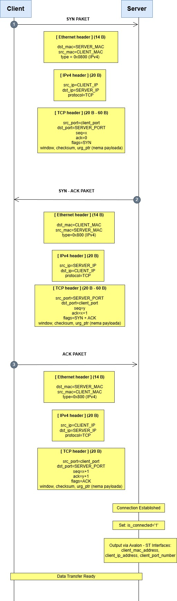
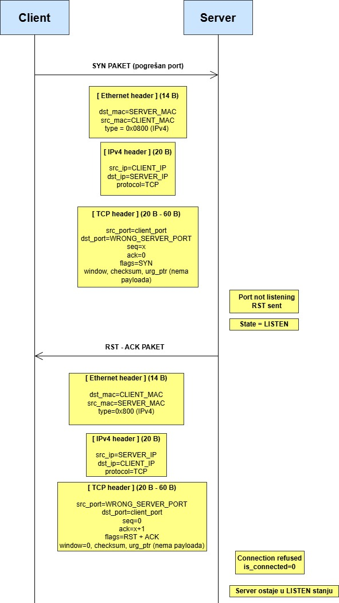
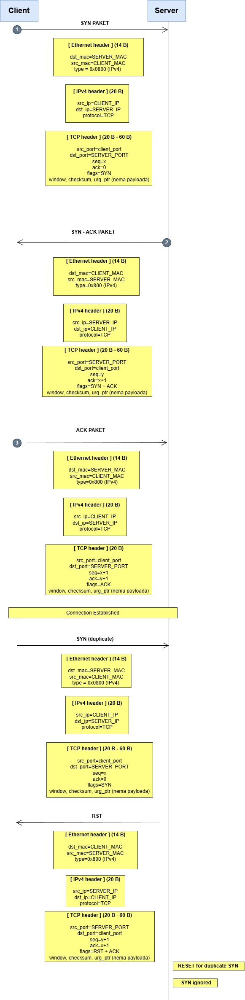

# TCP Server Handshake – Projekat

## Struktura repozitorija
- 'docs/' – dijagrami (FSM, WaveDrom, sekvenijalni dijagrami)
- 'src/' – VHDL kod (entitet, arhitektura)
- 'tb/' – testbench fajlovi
- 'sim/' – rezultati simulacije (screenshotovi)
---
# TCP 

**TCP (Transmission Control Protocol)** je temeljni komunikacijski protokol koji omogućava pouzdanu razmjenu podataka između dva uređaja u mreži. Za razliku od jednostavnijih protokola poput UDP-a, TCP garantuje da će svi podaci stići tačno, redoslijedom kojim su poslani, bez gubitaka ili duplikata.

TCP koristi **mehanizam kontrole toka, potvrda prijema (ACK) i ponovnog slanja** kako bi osigurao pouzdanost. Ključni dio tog procesa je **trostruko rukovanje (three-way handshake)** — inicijalna razmjena poruka kojom se uspostavlja konekcija između klijenta i servera.

Prilikom uspostavljanja veze, TCP koristi tri koraka:

**1. SYN** – Klijent šalje zahtjev za konekciju.

**2. SYN-ACK** – Server potvrđuje prijem i šalje vlastiti zahtjev.

**3. ACK** – Klijent potvrđuje i konekcija je uspostavljena.

Ovaj proces omogućava obje strane da se usaglase o početnim parametrima komunikacije, uključujući početne sekvence, portove i IP adrese. Na slici ispod prikazan je tok stanja i razmjena poruka tokom TCP three-way handshakea, kako bi se vizualno pojasnio proces uspostavljanja konekcije. [4]

  

<i>Slika 1. 3 way handshaking [4] </i>

----
## Struktura TCP segmenta 
Pakete u transportnom sloju nazivamo segmentima. Struktura TCP segmenta izgleda ovako (Slika 2) [2].

  

<i>Slika 2. Struktura TCP segmenta </i>

TCP segment sadrži sljedeća polja:

- **Source port** - Broj porta izvora **(16 bita)**
- **Destination port** - Broj porta odredišta **(16 bita)**
- **Sequence number** - Ako je SYN zastavica postavljena na (1), tada je ovo početni redni broj. Redni broj stvarnog prvog bajta podataka i potvrđeni broj u odgovarajućem ACK-u tada su ovaj redni broj plus 1. Ako je SYN zastavica postavljena na (0), tada je ovo akumulirani slijedni broj prvog bajta podataka ovog segmenta za trenutnu sesiju. **(32 bita)**
- **Acknowledgment number** - Sljedeći očekivani bajt preko TCP protokola **(32 bita)**
- **Data Offset** - Određuje veličinu TCP zaglavlja u 32-bitnim riječima . Minimalna veličina zaglavlja je 5 riječi, a maksimalna 15 riječi, što daje minimalnu veličinu od 20 bajtova, a maksimalnu od 60 bajtova, dopuštajući do 40 bajtova opcija u zaglavlju. **(4 bita)**
- **Reserved** - Ima značenje 0 **(3 bita)**
- **Control bits** - Upravljaju funkcijama podešavanja, kontrolom zagušenja mreže i završetak seanse-sesije **(9 bita)**. Poseban bit koji ima određenu svrhu, često se naziva zastavicom.
- **Window Size** - Veličina prozora za prijem , koja određuje broj jedinica veličine prozora koje pošiljatelj ovog segmenta trenutno želi primiti. **(16 bita)**
- **Checksum** - Izračunata kontrolna suma zaglavlja i podataka. Koristi se za provjeru pogrešaka TCP zaglavlja, korisnog tereta i IP pseudo-zaglavlja. **(16 bita)** 
- **Urgent Pointer** - Ovo polje označava na kraj hitnih podataka **(16 bita)** 
- **Options** - Mogu, a ne moraju biti uključene; ako postoje, veličine su x×8 bita **(0 ili 32 bita, ako je dostupno)**
- **Padding** - Dopuna nulama do **32 bita**.
---

## Opis projekta i popis signala

TCP handshake protokol omogućava pouzdano uspostavljanje konekcije između klijenta i servera putem trostrukog rukovanja (SYN, SYN-ACK, ACK), gdje server prima SYN paket, odgovara SYN-ACK, a zatim potvrđuje klijentov ACK, aktivirajući signale is_connected, client_mac, client_ip i client_port. U kontekstu VHDL modula tcp_server, komunikacija se odvija preko Avalon-ST interfejsa (in_data/valid/sop/eop/ready i out_data/valid/sop/eop/ready), gdje server obrađuje ulazne pakete i generiše izlazne bez podataka u fazi handshake-a. Identificirani scenariji uključuju uspješan handshake i greške poput timeout ili RST i duplikovani SYN (SYN FLOOD ZAŠTITA).

###  Generički parametri
Parametri se zadaju prilikom instanciranja modula i predstavljaju identitet servera:

- **SERVER_MAC** – fizička adresa mrežnog interfejsa servera.
- **SERVER_IP** – IP adresa servera.
- **SERVER_PORT** – TCP port na kojem server „sluša“ konekcije.

### Ulazni signali
- `clock` – glavni takt sistema.
- `reset` – resetuje modul u početno stanje.
- `in_data (8 bita)` – bajt podataka koji dolazi sa mreže.
- `in_valid` – označava da je `in_data` trenutno validan.
- `in_sop` – „start of packet“ – početak paketa.
- `in_eop` – „end of packet“ – kraj paketa.
- `out_ready` – dolazi od prijemnika; označava da je spreman da primi izlazne podatke.

### Izlazni signali
- `is_connected` – pokazuje da je TCP konekcija uspješno uspostavljena.
- `client_mac` – MAC adresa klijenta.
- `client_ip` – IP adresa klijenta.
- `client_port` – TCP port klijenta.
- `in_ready` – govori da je server spreman da primi ulazne podatke.
- `out_data (8 bita)` – bajt podataka koji server šalje ka klijentu.
- `out_valid` – označava da je `out_data` validan.
- `out_sop` – početak paketa koji server šalje.
- `out_eop` – kraj paketa koji server šalje.

---

## Scenariji komunikacije

## 1. Uspješan Handshake scenarij:

#### 1. Klijent šalje SYN

- Klijent inicira vezu tako što šalje paket sa zastavicom SYN=1 na Avalon-ST ulaz servera (in_sop='1', in_valid='1'). U tom paketu postavlja početni broj sekvence (seq=x). **Server je u stanju LISTEN i čeka SYN.** Nakon slanja, klijent prelazi u stanje SYN‑SENT. [4] 

#### 2. Server odgovara sa SYN‑ACK

- Server prepoznaje SYN, postavlja klijentske parametre (client_mac/ip/port). Ako server prihvati vezu, šalje paket sa zastavicama SYN=1 i ACK=1 (out_sop='1', out_valid='1'). Server postavlja svoj broj sekvence (seq=y) i potvrđuje klijentov broj (ack=x+1). **Server prelazi u stanje SYN‑RCVD.** [4] 

#### 3. Klijent šalje završni ACK

- Klijent potvrđuje prijem SYN‑ACK paketa slanjem ACK=1. U tom paketu stoji seq=x+1 i ack=y+1. Nakon primljenog ACK-a, server postavlja is_connected='1' - oba kraja prelaze u **ESTABLISHED** stanje (veza je uspostavljena) i izlaze klijentovi podatci (client_mac, client_ip, client_port). [4] 

Razmjena se prikazuje sekvencijskim dijagramom.

  

<i>Slika 3. Uspješan Handshake scenarij </i>

## Wavedrom dijagram

  

<i>Slika 4. Wavedrom dijagram za scenarij uspješne konekcije </i>

## 2. Neuspješna konekcija: Nepostojeći Port

- Klijent šalje **SYN** na port koji server ne sluša **(npr. SERVER_PORT mismatch)**, server odgovara **RST-ACK** (seq=0, ack=seq_klijent+1) i odbija konekciju. Modul ostaje u **LISTEN** stanju bez promjene stanja. Ovo sprječava neovlašteni pristup. [1]​

  

<i>Slika 5. Neuspješna konekcija: Nepostojeći port </i>

## Wavedrom dijagram

  

<i>Slika 6. Wavedrom dijagram za scenarij neuspješne konekcije (nepostojeći port) </i>

## 3. Duplikovani SYN (SYN flood zaštita)
- Klijent prvo šalje **SYN** s početnim sekvencijskim brojem x, na što server odgovara **SYN-ACK** paketom sa svojim brojem y i potvrdom klijentovog broja (ack=x+1). Klijent zatim šalje završni **ACK** (ack=y+1), čime se veza formalno uspostavlja. Međutim, nakon toga stiže **novi SYN** s istim brojem kao prvi — duplikat koji može nastati zbog retransmisije, greške ili zlonamjerne radnje. Budući da server već ima aktivnu vezu s tim parametrima, prepoznaje duplikat i šalje **RST (reset)** paket s brojem y+1 kako bi odbacio taj zahtjev. TCP dizajn omogućava da se takvi duplikati ignoriraju bez prekida postojeće sesije, čime se osigurava stabilnost i sigurnost komunikacije. [1]

  

<i>Slika 7. Neuspješna konekcija: duplikovani SYN </i>

## Wavedrom dijagram

  

<i>Slika 8. Wavedrom dijagram za scenarij duplikovanog SYN-a </i>

---

# TCP stanja

Tijekom procesa trostrukog rukovanja postoji 6 vrsta TCP stanja koja se nazivaju: CLOSED, LISTEN, SYN-SENT, SYN-ACK SENT, SYN RCVD i ESTABLISHED. Donja tabela navodi detalje svakog stanja: (Slika 9) [3]

  

<i>Slika 9. Tabela stanja za TCP [3] </i>

## TCP stanja – serverska strana

U prethodnoj tabeli prikazana su **sva TCP stanja** koja se pojavljuju tokom uspostavljanja i prekida veze, uključujući i klijentsku stranu.

Kako je naš projekat fokusiran na **TCP server handshake**, u nastavku su izdvojena samo ona stanja koja se tiču **serverske strane** i koja su relevantna za implementaciju u ovom modulu.

  
| TCP stanje       | Uloga servera                                                                 |
|------------------|-------------------------------------------------------------------------------|
| CLOSED           | Server nema aktivnu konekciju (resetovan ili konekcija završena).             |
| LISTEN           | Server pasivno čeka SYN od klijenta na definisanom portu.                     |
| SYN_RCVD         | Server je primio SYN i poslao SYN‑ACK; sada čeka završni ACK od klijenta.     |
| ESTABLISHED      | Veza je uspostavljena; server i klijent mogu razmjenjivati podatke.           |

---

## Literatura

[1] "TCP Connection Establishment and Termination" [Na internetu].  
Dostupno:(https://people.na.infn.it/~garufi/didattica/CorsoAcq/Trasp/Lezione9/tcpip_ill/tcp_conn.htm) [pristupljeno: 14-pro-2025].

[2] "TCP/IP – Transportni sloj," u *Mreže – Layer-X*. [Na internetu].  
Dostupno: http://mreze.layer-x.com/s040100-0.html#google_vignette [pristupljeno: 14-pro-2025].

[3] "TCP 3-Way Handshake Process," u *NetworkWalks*. [Na internetu].  
Dostupno: https://networkwalks.com/tcp-3-way-handshake-process/ [pristupljeno: 14-pro-2025].

[4] "TCP 3-Way Handshaking," u *Wireshark Wiki*. [Na internetu].  
Dostupno: https://wiki.wireshark.org/TCP_3_way_handshaking [pristupljeno: 14-pro-2025].

[5] "Avalon® Interface Specifications - Intel" [Na internetu].  
Dostupno: (https://cdrdv2-public.intel.com/667068/mnl_avalon_spec-683091-667068.pdf) [pristupljeno: 14-pro-2025].

